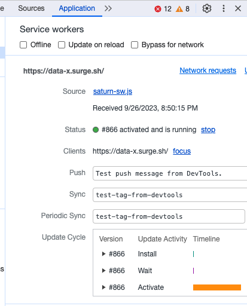

 

    

 

DataX | A bid/ask marketplace for curated datasets.
---

DataX is a bid/ask marketplace concept for data similar to StockX where users can list data their unique and custom datasets for sale with the ability for public search and potential buyers to set their asking price. 

Built using NextJS, Filecoin FVM, Tableland, Dataverse, Saturn, and web3.storage for the Encode Open Data hackathon 2023.

Live Demo: https://data-x.surge.sh (calibration)

Demo video: https://youtu.be/QQEwZOEAQjI

Pitch slides: https://docs.google.com/presentation/d/1h30Fic6S2ALmAOz_mFOzgp0uBYAjAMlzdhefXmbDgOo/edit#slide=id.g28a8e7e850a_0_140

Note that networks with faster block times will give better UX and settlement for table/backend mutations (ex: indexing listings for search, recording purchases/offers). Calibration has a 30s block time - this has been edited for the demo video.

## Inspiration

DataX creates a community around the curation and sharing and of both publically and privately created datasets.

The inspiration for DataX came from the need for a reliable and efficient marketplace where data can be traded just like other commodities. 

Existing data marketplaces have shown significant shortcomings that hinder their effectiveness and impede the seamless exchange of data:

1. Lack of Transparency: Many data marketplaces operate opaquely, making it difficult for data consumers to assess the quality and provenance of the data they seek. DataX, on the other hand, is built on a foundation of transparency, ensuring that users have access to comprehensive information about each dataset's source, history, and reliability.

2. Centralization and Monopoly: Traditional data marketplaces are often centralized, controlled by a single entity, which can lead to monopolistic practices, inflated prices, and limited choices. DataX adopts a decentralized approach, empowering data owners to set their own prices and enabling a competitive, diverse ecosystem.

3. Inflexible Pricing Models: Existing platforms may offer limited flexibility in pricing, making it challenging for data sellers to maximize the value of their assets. DataX allows data providers to name their price and even adjust it based on previous offers, facilitating fair negotiations and dynamic pricing strategies.

4. Inefficient Data Discovery: Finding the right dataset can be like searching for a needle in a haystack on some platforms, as they lack effective search and recommendation systems. DataX employs advanced algorithms to streamline data discovery, ensuring that data consumers can easily find the information they need. Each dataset on DataX gets it's own public purchase url that can be shared on the web.

5. Data Ownership and Security Concerns: Many data marketplaces do not adequately address data ownership and security concerns. DataX prioritizes data ownership rights and employs cutting-edge security measures to protect data throughout its lifecycle.

 We wanted to create a platform that empowers data owners to monetize their data assets while allowing data consumers to access valuable information in a transparent and decentralized manner. Sellers of the data can name their price to reveal a dataset and potential purchaser can either immediately buy it or make an offer. The seller can later change their price to match previous offers.

## What it does

DataX provides a user-friendly interface for listing various types of data sets. Data owners can upload their data, set a minimum asking price, and choose whether to list their data as an auction or for direct purchase. On the other side, data consumers can search for specific data sets, place bids in auctions, or directly purchase data at the listed prices.

Each uploaded data set gets its own FVM smart contract and unique url identified by the contract address. When a listing visitor purchases a dataset, a transaction is made against the listing contract, a transaction and transfer via the contract is recorded, and lastly Saturn securely delivers the car file representation of the data to the buyer via the cid.

Under 5MB can upload directly
Over 5MB can provide a link to the cid
DataX will provide instructions for both uploading and accessing files either through the app or a lotus client.

Uploaded Datasets all have a validation flag on them. By default all datasets are marked unvalidated until reviewed by an admin of the app (admins specified on the environment when the app is deployed). Unvalidated datasets can be purchased at buyers discretion.

### Core functions
* Create listing
* Search listings
* Buy listing
* Validate listing (from admin panel)
* Make offer
* See offers
* View data set purchase history (from blockchain explorer).

## Technologies used

Filecoin FVM: The Filecoin File Verification Marketplace (FVM) integration ensures the security and immutability of listed data. This technology guarantees that data remains tamper-proof and accessible only to authorized users. Filecoin smart contracts are used for access control and auditing of offers. Every DataX listing gets its own unique contract.

Example contract here: https://calibration.filscan.io/address/0x6886489D4c3e3C89b70a56DC8e8984eccF520728/

Tableland: Tableland is employed to manage the complex data relationships within the marketplace, enabling efficient search and discovery of relevant data sets. 

web3.storage: To address the challenge of decentralized storage, we integrated web3.storage, which utilizes blockchain technology to securely store and retrieve data files.

Filecoin Saturn: Saturn secures each data set client side with .car files delivered to the purchaser that guarantee additional tamper and hack-proofing from the original upload time (i.e. the original dataset is verified to be the one delivered on purchase). Validation is done using a hosted browser client service worker.

DataverseOS: Authentication and user state management plugging into existing wallets and providers the customer may already use (i.e. metamask).

NextJS: We utilized NextJS to create a responsive and interactive frontend interface that offers a seamless browsing experience for users. Deployed on surge.

<!-- Filecoin (8): Compatiable with many of the existing EVM toolkits like ethers made it easy to get up and running. Actors/deals have some learning curve.
Tableland (7): Bit harder to debug and somewhat subject to the block settlement times with tables. Some missing functionality with the react sdk but the discord was helpful
web3.storage (9): Have used this for several projects and works consistently and is a great bridge to using distributed storage.
Filecoin Saturn (7): Value prop of downloading as .car for an average user might not be super obvious. Asked a question in the discord on how to get the service worker running and got it resolved easily (browser verification).
Dataverse (7): Some overlap with tableland functionality, but used this as a wrapper for core authentication. Had some small issues with nextjs and server side rendering but was able to resolve. Wasn't able to easily select a second wallet address within a wallet (seemed like it was selecting the first one by default). Worked otherwise though!
 -->

<!-- Saturn: Data validation (using browser client). https://github.com/filecoin-saturn/browser-client -->

 
Note this project is a hackathon prototype and would require additional work to be mainnet/production ready.

## Running the project (from scratch)

1. Copy `.env.sample` -> `.env`

2. Define the `NEXT_PUBLIC_ADMIN_ADDRESS` to your desired management address in `.env`. This account will be used to set up the app tables and verify submitted listings.

3. `yarn; yarn dev`. The app should now be running on port 3000.

4. Go to `localhost:3000/admin`. Connect your wallet using the same address from step 3. Note other pages will not be functional yet.

5. Deploy tables and copy table values to `.env`. Fill in remaining `.env` values.

6. Restart the server and test locally.

7. Do a production build and deployment following the below.

Any repeated starts can be done with `yarn dev` once all variables set.

### Deployment build

This command deploys the build site to surge.sh by default, feel free to edit to your desired deployment destination in `package.json`.

`yarn build; yarn deploy`

<!-- ## Challenges we ran into

## Accomplishments that we're proud of

## What we learned -->
### Hosted saturn service worker

### Screenshots
        

## Potential future work
* Implement advanced data analytics tools to provide insights and trends on data usage, helping both sellers and buyers make informed decisions.
* Introduce real-time bidding functionality, allowing buyers to dynamically bid on data listings and enabling sellers to maximize their earnings.
* Enhance data verification processes by exploring additional blockchain technologies to ensure the integrity and authenticity of listed data.
* Collaborate with industry partners to onboard a wider range of data providers, enriching the variety and value of data available on the platform.
* Develop mobile applications for DataX to extend its accessibility, enabling users to engage in data transactions on-the-go.

### Useful links
* https://www.encode.club/open-data-hack
* https://ownershiplabs.notion.site/DataverseOS-Builders-Hackathon-2-0-377b2b3337454311ace6eb82a6ef5472
* https://docs.tableland.xyz/sdk/database/
